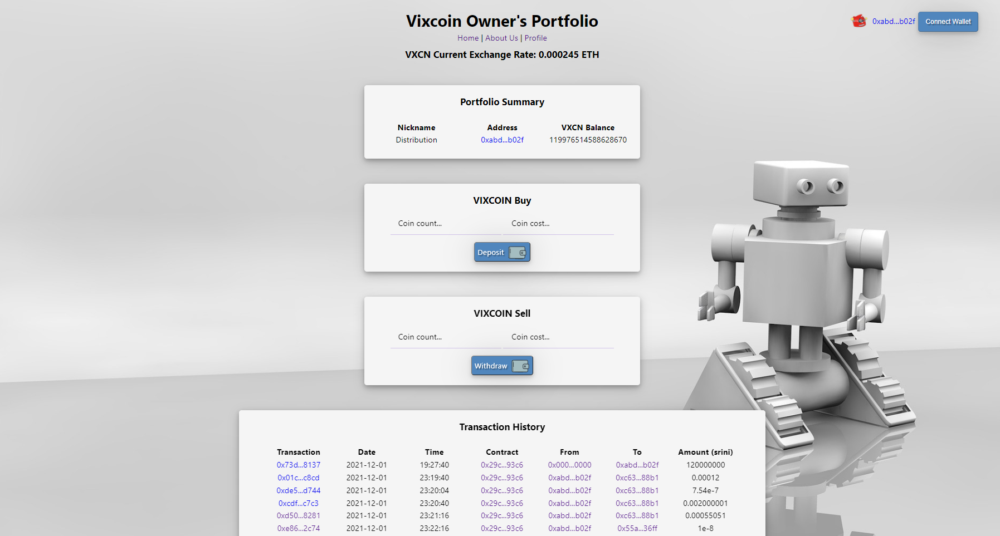

<div id="top"></div>

<!-- PROJECT LOGO -->
<br />
<div align="center">
  <a href="https://github.com/Fintech-Collaboration/vixx-token-dapp">
    
  </a>

  <h3 align="center">VIXCOIN</h3>

  <p align="center">
   VIXCOIN is the 1st DeFi/CeFI company that provides a solution to invest long-term in volatility!  
    <br />
    <a href="https://github.com/Fintech-Collaboration/vixx-token-dapp"><strong>Explore the docs »</strong></a>
    <br />
    <br />
    <a href="https://github.com/Fintech-Collaboration/vixx-token-dapp">View Demo</a>
    ·
    <a href="https://github.com/Fintech-Collaboration/vixx-token-dapp/issues">Report Bug</a>
    ·
    <a href="https://github.com/Fintech-Collaboration/vixx-token-dapp/issues">Request Feature</a>
  </p>
</div>

<!-- TABLE OF CONTENTS -->
<details>
  <summary>Table of Contents</summary>
  <ol>
    <li>
      <a href="#about-the-project">About The Project</a>
      <ul>
        <li><a href="#built-with">Built With</a></li>
      </ul>
    </li>
    <li>
      <a href="#getting-started">Getting Started</a>
      <ul>
        <li><a href="#installation">Installation</a></li>
      </ul>
    </li>
    <li>
      <a href="#usage">Usage</a></li>
     <ul>
       <li><a href="#demo">Demo</a></li>
    </ul>
    <li><a href="#token-valuation">Token Valuation</a></li>
    <li><a href="#license">License</a></li>
    <li><a href="#contact">Contact</a></li>
    <li><a href="#acknowledgments">Acknowledgments</a></li>
  </ol>
</details>

<!-- ABOUT THE PROJECT -->
## About The Project
VIXCOIN is a defi/cefi solutions company that has created a way to invest long-term in volatility using a digital token which is VIXCOIN 
Our first product utilizes VIXM as the financial investment vehicle but there are plans to expand to others. 

How it works:
Users can purchase a token on our website that acts like security on a long-term volatility instrument. 
Using our algorithmic trading strategy when there are buy and sell signals, we take our users cash and invest it in VIXM. 
Our company provides both a product (VIXCOIN) and a service which is the trading strategy. 

* The VIXCOIN token is ERC20 (fungible) and was created utilizing the Etherum blockchain 
* The token links digital assets with traditional investments. 
* Offers a way to diversify an investors' portfolio during market downturns.
* Opens up investment opportunities to global investors since it was traditional only available to those in the US. 
* Token does not rely on supply and demand. It derives value from the performance of our algorithmic trading strategy. 


DISCLAIMER: Our product is only deployed to a testnet and our user interface can only be launched locally. Investment in our product is not an option yet. 

<p align="right">(<a href="#top">back to top</a>)</p>

### Built With
The dApp was built utilizing at least python 3.7 for the back end data analysis and machine learning for the algorithmic trading strategy.

Python Packages
* [Pandas](https://pandas.pydata.org/)
* [Numpy](https://numpy.org/)
* [Datetime](https://pypi.org/project/DateTime/)
* [yfinance](https://pypi.org/project/yfinance/)
* [Sci-kit learn](https://scikit-learn.org/stable/)
* [Hvplot](https://hvplot.holoviz.org/)
* [Matplotlib](https://matplotlib.org/)

Smart Contracts
* [Solidity](https://docs.soliditylang.org/en/v0.8.10/)
* [REMIX IDE](https://remix.ethereum.org)
* [Chainlink](https://chain.link/)

User Interface
* [Django](https://www.djangoproject.com/)
* [JSON](https://www.json.org/json-en.html)

Wallet Integration
* [Metamask](https://metamask.io/)

<p align="right">(<a href="#top">back to top</a>)</p>

<!-- GETTING STARTED -->
## Getting Started
To get a local copy up and running follow these steps below. 
Alternatively, you can jump straight to the demo section and test out the wesbite portion. 

### Installation
1. Clone the repo
   ```sh
   git clone https://github.com/Fintech-Collaboration/vixx-token-dapp.git
   ```
2. Install python packages listed in the Built With section. 
3. To test out the algorithmic trading strategy file, first go to your terminal. 
4. In your terminal, navigate to the location where the cloned repo resides.
5. Locate vixm_adaboost_model.ipynb and launch the file in jupyter notebook for data visualizations. 
6. Alternatively, if you would like to rerun the model, you may import the file into Google Colab. 
7. Website functions are covered in the Demo portion. 

<!-- USAGE EXAMPLES -->
## Usage
There are multiple components to our dApp: 
1. ML/AL trading strategy 
2. smart contract
3. web3.py
4. Django UI

Please refer to installation section for how to run the trading strategy. 
For the UI, please see the next section below. 

<p align="right">(<a href="#top">back to top</a>)</p>

### Demo
1. To launch the user interface, make sure that you have installed Django for python.
2. In the terminal, navigate to the vixx-trader file from the cloned repo.
3. Start the Django app, enter the info below: 
  ```sh
    python manage.py startapp <vixx_trader>
   ```
4. If launched, properly, you should see the image below
<div align="center">
    
  </a>

<p align="right">(<a href="#top">back to top</a>)</p>

<!-- Token Value -->
## Token Valuation
<div align="center">
    
  </a>

The price of the VixCoin token is linked to the performance of the investment strategy.
Here is a comparison of the performance of the VIXCOIN token and the SP500 out-of-sample.  
As you can see: If you would have invested $1 in Oct 2019, by the end of 2021 the value of your coin would be $2.50, which is a 150% return, above the 60% of the S&P500. 

In our smart contract, we utilize the following formula in order to set the price of the token. 
TP_t = TP_y  * (1+r*s)
 Where s is the signal predicted for the day
   r is the daily VIXM return
token_price_today = token price yesterday*(1+vixm_return_yesterday*signal_hat_yesterday)

In order to get VIXM data, we utilize Chainlink to call price feeds into the contract. 

NOTE: Current contract that is connected to Django does not utilize the formula above. It is a work in progress. 

<p align="right">(<a href="#top">back to top</a>)</p>

<!-- LICENSE -->
## License
<div align="left">
Distributed under the MIT License.
https://github.com/git/git-scm.com/blob/main/MIT-LICENSE.txt)

<p align="right">(<a href="#top">back to top</a>)</p>

<!-- CONTACT -->
## Contact
<div align="left">
Jason Garcia -(https://www.linkedin.com/in/24-jason-j-garcia/) 

  Project Link: [https://github.com/jasonjgarcia24](https://github.com/jasonjgarcia24)

Prateek Sharma - (https://www.linkedin.com/in/prateek-sharma-21a081180/) 

  Project Link: [https://github.com/puru444](https://github.com/puru444)

Paola Carvajal- (https://www.linkedin.com/in/paolacarvajal/)

  Project Link: [https://github.com/paocarvajal1912](https://github.com/paocarvajal1912)

Srini Goda - (https://www.linkedin.com/in/srini-goda-2305644/) 

  Project Link: [https://github.com/your_username/repo_name](https://github.com/your_username/repo_name)

Jasmine Tengsico - (https://www.linkedin.com/in/jasmine-tengsico-5030b0167/)

  Project Link: [https://github.com/jtengsico](https://github.com/jtengsico)

<p align="right">(<a href="#top">back to top</a>)</p>


<!-- ACKNOWLEDGMENTS -->
## Acknowledgments
Credit to creator of readme template. 
* [README Template](https://github.com/othneildrew/Best-README-Template.git)

<p align="right">(<a href="#top">back to top</a>)</p>

