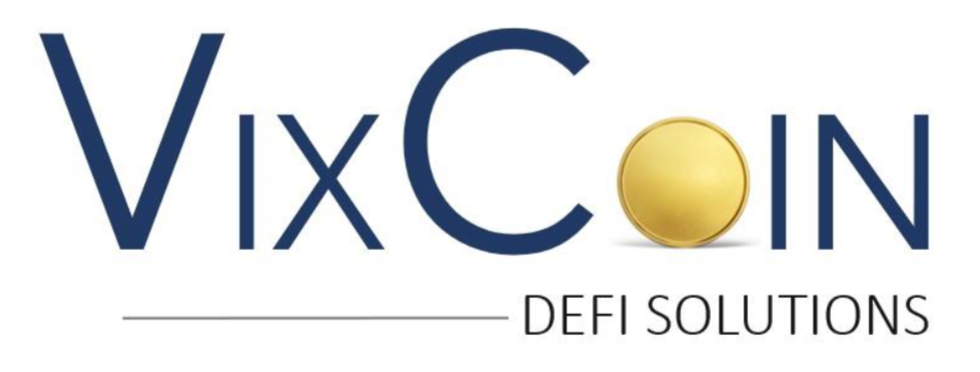
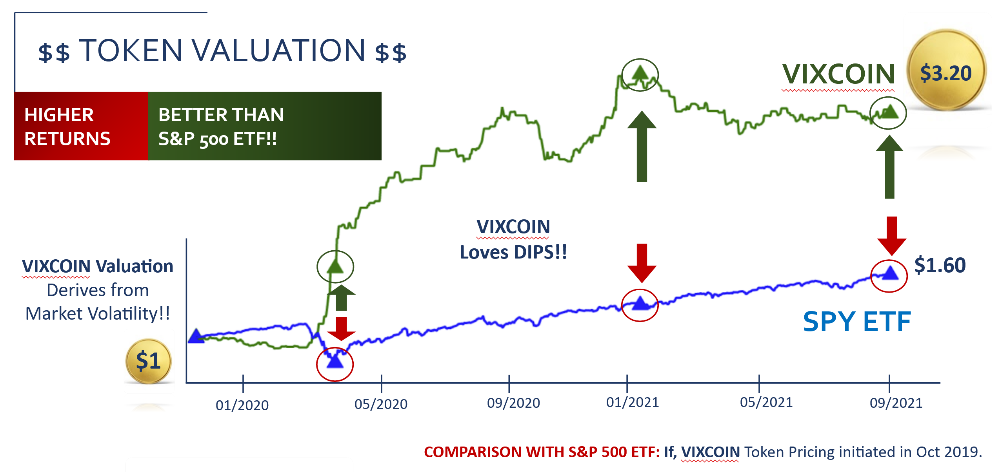

<div id="top"></div>

<!-- PROJECT LOGO -->
<br />
<div align="center">
  <a href="https://github.com/Fintech-Collaboration/vixx-token-dapp">
    
  </a>

  <h3 align="center">VIXCOIN</h3>

  <p align="center">
    VIXCOIN the best way to invest in volatility!
    <br />
    <a href="https://github.com/Fintech-Collaboration/vixx-token-dapp"><strong>Explore the docs »</strong></a>
    <br />
    <br />
    <a href="https://github.com/Fintech-Collaboration/vixx-token-dapp">View Demo</a>
    ·
    <a href="https://github.com/Fintech-Collaboration/vixx-token-dapp/issues">Report Bug</a>
    ·
    <a href="https://github.com/Fintech-Collaboration/vixx-token-dapp/issues">Request Feature</a>
  </p>
</div>


<!-- TABLE OF CONTENTS -->
<details>
  <summary>Table of Contents</summary>
  <ol>
    <li>
      <a href="#about-the-project">About The Project</a>
      <ul>
        <li><a href="#built-with">Built With</a></li>
      </ul>
    </li>
    <li>
      <a href="#getting-started">Getting Started</a>
      <ul>
        <li><a href="#installation">Installation</a></li>
      </ul>
    </li>
    <li><a href="#usage">Usage</a></li>
    <li><a href="#token-valuation">Token Valuation</a></li>
    <li><a href="#license">License</a></li>
    <li><a href="#contact">Contact</a></li>
    <li><a href="#acknowledgments">Acknowledgments</a></li>
  </ol>
</details>


<!-- ABOUT THE PROJECT -->
## About The Project

[![Product Name Screen Shot][product-screenshot]](https://example.com)

VIXCOIN is the 1st DeFi/CeFI company that provides a solution to invest long-term in volatility!  
We created the VIXCOIN token on the Etherum blockchain annd it links digital assets with traditional investments. 
The token offers a way to diversify an investors' portfolio during market downturns. 
Also, the token does not rely on supply and demand. VIXCOIN derives its value from the performance of our algorithmic trading strategy. 
Thus if our strategy is performing well, then our token value will be higher. 
Our company provides a product (VIXCOIN) and a service which is the trading strategy. 

<p align="right">(<a href="#top">back to top</a>)</p>


### Built With

This section should list any major frameworks/libraries used to bootstrap your project. Leave any add-ons/plugins for the acknowledgements section. Here are a few examples.

* [Next.js](https://nextjs.org/)
* [React.js](https://reactjs.org/)
* [Vue.js](https://vuejs.org/)
* [Angular](https://angular.io/)
* [Svelte](https://svelte.dev/)
* [Laravel](https://laravel.com)
* [Bootstrap](https://getbootstrap.com)
* [JQuery](https://jquery.com)

<p align="right">(<a href="#top">back to top</a>)</p>


<!-- GETTING STARTED -->
## Getting Started

This is an example of how you may give instructions on setting up your project locally.
To get a local copy up and running follow these simple example steps.


### Installation

1. Get a free API Key at [https://example.com](https://example.com)
2. Clone the repo
   ```sh
   git clone https://github.com/Fintech-Collaboration/vixx-token-dapp.git
   ```
3. Install NPM packages
   ```sh
   npm install
   ```
4. Enter your API in `config.js`
   ```js
   const API_KEY = 'ENTER YOUR API';
   ```
5. Get a free API Key at [https://example.com](https://example.com)
6. Clone the repo
   ```sh
   git clone https://github.com/your_username_/Project-Name.git
   ```
7. Install NPM packages
   ```sh
   npm install
   ```
8. Enter your API in `config.js`
   ```js
   const API_KEY = 'ENTER YOUR API';

<p align="right">(<a href="#top">back to top</a>)</p>


<!-- USAGE EXAMPLES -->
## Usage

Use this space to show useful examples of how a project can be used. Additional screenshots, code examples and demos work well in this space. You may also link to more resources.

_For more examples, please refer to the [Documentation](https://example.com)_

<p align="right">(<a href="#top">back to top</a>)</p>


<!-- Token Value -->
## Token Valuation
<div align="center">
    
  </a>


<p align="right">(<a href="#top">back to top</a>)</p>


<!-- LICENSE -->
## License

Distributed under the MIT License.
See [license txt](https://github.com/git/git-scm.com/blob/main/MIT-LICENSE.txt)

<p align="right">(<a href="#top">back to top</a>)</p>


<!-- CONTACT -->
## Contact

Jason Garcia -(https://www.linkedin.com/in/24-jason-j-garcia/) 

Project Link: [https://github.com/jasonjgarcia24](https://github.com/jasonjgarcia24)

Prateek Sharma - (https://www.linkedin.com/in/prateek-sharma-21a081180/) 

Project Link: [https://github.com/puru444](https://github.com/puru444)

Paola Carvajal- (https://www.linkedin.com/in/paolacarvajal/)

Project Link: [https://github.com/paocarvajal1912](https://github.com/paocarvajal1912)

Srini Goda - (https://twitter.com/your_username) 

Project Link: [https://github.com/your_username/repo_name](https://github.com/your_username/repo_name)

Jasmine Tengsico - (https://www.linkedin.com/in/jasmine-tengsico-5030b0167/)

Project Link: [https://github.com/jtengsico](https://github.com/jtengsico)

<p align="right">(<a href="#top">back to top</a>)</p>


<!-- ACKNOWLEDGMENTS -->
## Acknowledgments
Credit to creator of readme template. 
* [README Template](https://github.com/othneildrew/Best-README-Template.git)

<p align="right">(<a href="#top">back to top</a>)</p>

